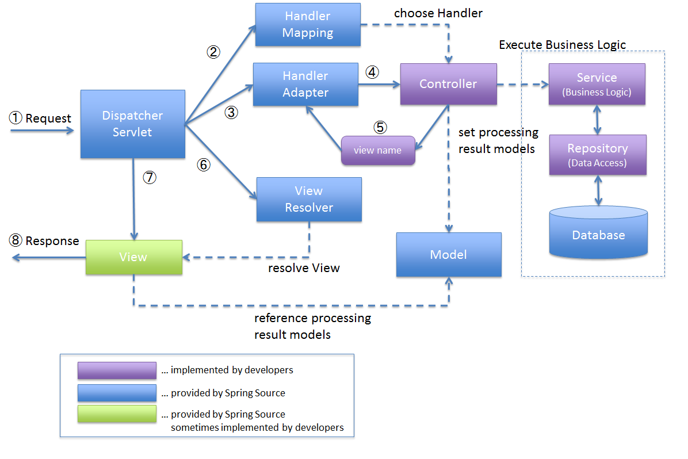

# POJO(Plain Old Java Object):
1. 스프링은 POJO를 기반으로 애플리케이션을 개발합니다. 즉, 특정 인터페이스를 구현하거나 특정 클래스를 상속받지 않아도 되며, 일반적인 자바 객체로 작성된 코드를 재사용할 수 있습니다.

# 의존성 주입(Dependency Injection, DI):
2. 스프링은 객체 간의 의존성을 관리하고 제어하기 위해 DI를 사용합니다. DI는 객체가 직접 필요로 하는 의존성을 생성하는 것이 아니라 외부에서 주입받도록 하는 디자인 패턴입니다. 이를 통해 객체 간의 결합도를 낮추고 유연한 구조를 유지할 수 있습니다.

# 제어의 역전(Inversion of Control, IoC):
3. 스프링은 IoC 컨테이너를 통해 애플리케이션의 제어를 관리합니다. 일반적으로 객체의 생성과 생명주기를 개발자가 관리하는 것이 일반적인데, 스프링에서는 IoC 컨테이너가 객체의 생성과 관리를 담당합니다. 개발자는 이 컨테이너에게 객체 생성과 의존성 주입을 위한 설정 정보를 제공하여 제어의 역전을 이용합니다.

# AOP(Aspect-Oriented Programming):
4. 스프링은 AOP를 통해 애플리케이션의 여러 모듈에서 공통적으로 필요한 기능을 분리하여 재사용할 수 있습니다. 예를 들어, 로깅, 트랜잭션 관리, 보안 등과 같은 관심사를 별도의 모듈로 분리하여 필요한 곳에 적용할 수 있습니다.


# 웹 애플리케이션 개발 지원:
5. 스프링은 웹 애플리케이션을 개발하기 위한 다양한 모듈과 기능을 제공합니다. 웹 MVC 프레임워크(Spring MVC), 웹 서비스 지원(Spring Web Services), 보안(Spring Security) 등의 모듈을 통해 효율적인 웹 애플리케이션을 개발할 수 있습니다.
# 스프링 동작원리

1. DispatcherServlet이 브라우저로부터 요청을 받는다.
2. DispatcherServlet은 요청된 URL을 HandlerMapping 객체에 넘기고, 호출해야 할 Controller 메소드(핸들러) 정보를 얻는다.
3. DispatcherServlet이 HandlerAdapter 객체를 가져온다
4. HandlerAdapter 객체의 메소드를 실행한다.
5. Controller 객체는 비즈니스 로직을 처리하고, 그 결과를 바탕으로 뷰(ex. JSP)에 전달할 객체를 Model 객체에 저장한다. DispatcherServlet에게 view name을 리턴한다.
6. DispatcherServlet은 view name을 View Resolver에게 전달하여 View 객체를 얻는다.
7. DispatcherServlet은 View 객체에 화면 표시를 의뢰한다.
8. View 객체는 해당하는 뷰(ex. JSP, Thymeleaf)를 호출하며, 뷰는 Model 객체에서 화면 표시에 필요한 객체를 가져와 화면 표시를 처리한다
-  4.번에 정확한 설명은  HandlerMapping은 DispatcherServlet로부터 전달된 URL을 바탕으로 HandlerAdapter 객체를 포함하는 HandlerExecutionChain 객체를 생성하며, 이후 DispatcherServlet이 HandlerExecutionChain 객체로부터 HandlerAdapter 객체를 가져와서 해당 메소드를 실행하게 된다
- 실질적으로 Controller를 실행하는 것은 Handler Adapter이다.
- View Resolver는 "전략 객체"  View Resolver에게 전달되는 정보는 view name뿐만이 아니라, header 정보(accept 등)도 전달된다header 정보 내의 Accept는 기본적으로는 HTML에 따라서는 JSON, XML인 경우도 있다. View Resolver는 전달된 정보를 바탕으로 사용자에게 보여줄 view가 무엇인지를 결정한다.JSP의 경우 JstlView 객체가 생성된다. 
- JstlView 객체가 "abcd.jsp"에 포워딩하여 결과를 보여준다(JSP 객체를 생성하는 것이 아니다).
# spring mvc의 구성요소
1.  DispatcherServlet 는 모든 HTTP 요청을 받아들여서 다른 객체들 사이의 흐름을 제어 하는 역할을 한다. Front Controller를 담당
2. HandlerMapping 는 클라이언트의 요청을 바탕으로 어떤 Handler(Controller 메소드)를 실행할지 결정
3.  Model 는 Controller에서 View로 넘겨줄 객체가 저장되는 곳.
4.  ViewResolver 는  view name을 바탕으로 View 객체를 결정한다
5. View는 뷰에 화면 표시 처리를 의뢰하는 역할을 한다.
6.  Controller는 사용자의 요청이 진입하는 지점이며 요청에 따라 어떤 처리를 할지 결정해주며 단,controler는 단지 결정만 해주고 실질적인 처리는 서비스(Layered Architecture)에서 담당한다. view 를 응답으로 보내준다.
```
package Hello.Hellospring.controller;
import org.springframework.ui.Model;
import org.springframework.stereotype.Controller;
import org.springframework.web.bind.annotation.GetMapping;

@Controller
public class hellocontroller {

    @GetMapping("hello")
    public String hello(Model model){
        model.addAttribute("data","hello!!");
        return "hello";
    }
}
```
- 이게 스프링에 controller로 이다.
# 스프링 웹 개발 기초
1. 정적컨텐츠
- 클라이언트의 요청을 받고 서버에 미리 저장된 HTML, CSS, JS 등의 파일을 그대로 응답해 보여주는 것을 말합니다.
- 모든 클라이언트들의 요청에 대해 동일한 결과를 보여줍니다.
- 클라이언트로부터 localhost:8080/hello-static.html 요청이 들어오게 되면 우선 Tomcat 서버를 거치고 그 다음 컨트롤러에서 hello-static 에 매핑하는 동작이있는지 확인합니다.
이후 해당 동작이 없을 경우 /resources/static 하위에서 해당하는 파일을 찾아 반환해줍니다.
2. 동적 컨텐츠
- 어떤 클라이언트가 언제, 어디서, 어떻게 서버에 요청했는지에 따라 각기 다른 결과를 보여줍니다.
- MVC와 템플릿 엔진을 사용하는 방식과 API를 사용하는 방식으로 나뉩니다.
3. MVC(model,view,controller)와 템플릿 엔진을 이용한 웹 개발
- MVC 패턴을 이용해 Model, View, Cotroller로 나누어 웹을 개발하면 클라이언트가 서버에 웹 문서를 요청할 경우, HTML을 동적 으로 바꾸어 응답해줍니다.

